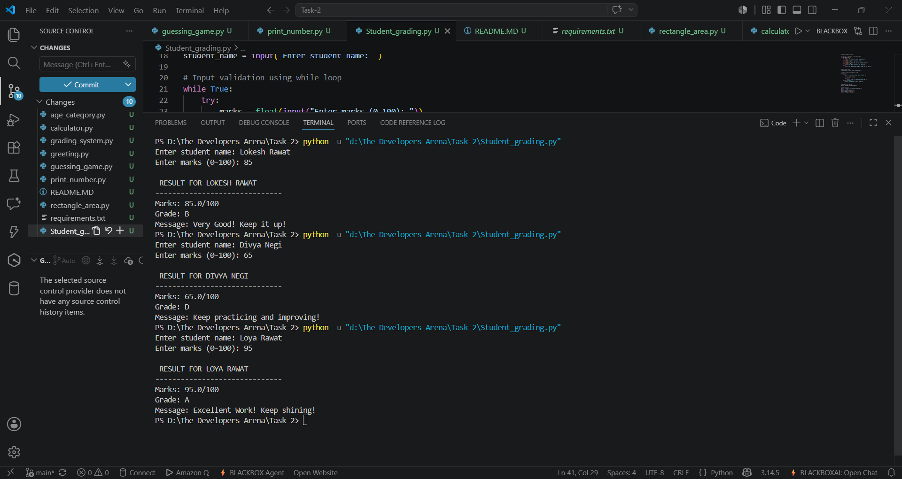

# 🎓 Student Grade Calculator

## 📌 Project Overview

This project is a Python-based Student Grade Calculator that accepts a student's name and marks and calculates the corresponding grade. It also displays encouraging messages based on the student's performance.

---

## 🎯 Objectives

* Use if-elif-else statements
* Implement input validation
* Create reusable functions
* Use while loops
* Display user-friendly output

---

## ⚙️ Setup Instructions

1. Install Python 3
2. Download the project files
3. Open terminal in project folder
4. Run:

```bash
python grade_calculator.py
```

---

## 🧠 Technical Details

### Grading Logic

| Marks  | Grade |
| ------ | ----- |
| 90-100 | A     |
| 80-89  | B     |
| 70-79  | C     |
| 60-69  | D     |
| 0-59   | F     |

### Concepts Used

* Functions
* If-Elif-Else
* While Loop
* Input Validation
* Exception Handling

---

## 📸 Screenshots

Output screenshots are available in the screenshots folder.



---

## 🧪 Testing

**Test Case 1**
```
Enter student name: Lokesh Rawat
Enter marks (0-100): 85

 RESULT FOR LOKESH RAWAT
------------------------------
Marks: 85.0/100
Grade: B
Message: Very Good! Keep it up
```

**Test Case 2**
```
Enter student name: Divya Negi
Enter marks (0-100): 65

 RESULT FOR DIVYA NEGI
------------------------------
Marks: 65.0/100
Grade: D
Message: Keep practicing and improving!
```

**Test Case 3**
```
Enter student name: Loya Rawat
Enter marks (0-100): 95

 RESULT FOR LOYA RAWAT
------------------------------
Marks: 95.0/100
Grade: A
Message: Excellent Work! Keep shining!
```

---

## 📚 What I Learned

* Decision making in Python
* Input validation techniques
* Creating reusable functions
* Error handling using try-except
